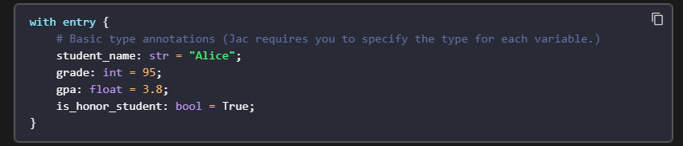

# Jac for Agentic Programming

Jac is a drop-in replacement for Python and supersets Python, much like Typescript supersets Javascript or C++ supersets C. It extends Python's semantics while maintaining full interoperability with the Python ecosystem, introducing cutting-edge abstractions designed to minimize complexity and embrace AI-forward development.

Jac targets Python bytecode, so all Python libraries work with Jac.

In addtion to traditional python classes (class or Jac's dataclass-like obj), Jac programmers can also use node classes (node), edge classes (edge), and walker classes (walker) for a new type of problem solving and agentic programming.

Instances of node and edge classes allow for assembling objects in a graph structure to express semantic relationships between objects.

**_Walker classes inverts the traditional relationship between data and computation. Rather than moving data to computation with parameter passing, walkers enable moving computation to data as they represent computational units that moves through the topology of node and edge objects.
These new constructs gives rise to a new paradigm for problem solving and implementation we call Object-Spatial Programming (OSP)._**

🧠 Jac vs Traditional Python Classes

In Python, you typically use class to define objects and their behavior. Jac supports that too, but it introduces three specialized class types for agentic and graph-based programming

🧩 Jac Class Types Explained    

    node:	it Represents entities or objects in a graph i.e. Like a person or place
    edge:	it Represents relationships or connections between nodee i.e. Like a friendship or road
    walker:	it Represents agents that move through the graph and perform tasks i.e Like a robot or courier

🚀 Why Use These?

Jac is designed for agentic programming—where autonomous agents (walkers) interact with a graph of nodes and edges to solve problems. This is powerful for:

    1. AI agents and simulations
    2. Knowledge graphs
    3. Workflow automation
    4. Game logic
    5. Multi-agent systems    

🧠 Example Use Case: Imagine you're building a smart city simulation:

        - node: Buildings, people, vehicles
        - edge: Roads, relationships, communication links
        - walker: A delivery drone navigating the city to drop packages   

##### 🧠 Node Properties Explained

| Keyword    | Purpose | Example |
| -------- | -------- | -------- |
| has | Declares attributes | has str name = "Alice"; |
|  can | Declares behaviors | can greet { report("Hi"); } |
| report() | Outputs messages | report("Node visited"); |
| here | Refers to the current node |here.name |
| spawn | Launches a walker from the node | spawn MyWalker(); |
| architype | Optional keyword to define node type inheritance | architype = "base_type"; |

##### 🧠 Built-in Walker movement commands

    visit(node_ref) – move to a specific node
    take(edge_ref) – follow an edge
    backtrack() – return to the previous node
    stop – end the walker’s journey

### Variables
Jac requires you to declare the type for every variable you create. This is known as strong typing. Unlike in Python, where type hints are optional, Jac makes them **mandatory.** This helps you catch common errors such as runtime type errors early and makes your code easier to read and maintain, especially as your projects grow.

Sometimes, you may need a variable that can hold values of different types. For these situations, Jac provides the **any** type similar to Python's dynamic typing.

#### Variable Declarations

To declare a variable in Jac, you specify its name, its type, and its initial value.

A literal is a fixed value you write directly in your code, like "Alice" or 95. Jac uses common literals like string, integer, float, and boolean.

It also introduces a special kind of literal called an **architype** (node, edge, and walker).

**Jac supports both local and global variables.** Local variables are defined within a block and are not accessible outside it, while global variables can be accessed anywhere in the code.

#### Functions
In Jac, you define a function using the **def keyword.** Just like with variables, you must specify the data type for each of the function's parameters and for the value it returns.

Jac is primarily an Object Spatial Language, but it also supports Object Oriented Programming (OOP) concepts. An object is a self-contained unit that combines data and behavior. In Jac, you can define a blueprint for an object using the obj keyword. Inside this blueprint, you define the object's data (called attributes) using the has keyword, and its behavior (called methods) using the def keyword.

Instead of needing a special method to initialize the object i.e. __init__ method you simply define the attributes with has and provide their values directly when you create a new instance of the object.

#### Collections 

Since Jac is a super-set of Python, it supports the same collection types: lists, dictionaries, sets, and tuples. However, Jac enforces __type annotations for all collections, ensuring type_safety and clarity.__

Jac supports list and dictionary comprehensions, which are a concise and powerful way to create new collections by processing existing ones.

The list comprehension syntax in Jac is similar to Python: **[expression for item in iterable if condition]** where, expression is the value to include in the new list, item is the variable representing each element in the original collection, iterable is the collection being processed, and condition is an optional filter.

#### Working with Loops
Loops allow you to run a block of code multiple times, which is essential for working with collections or performing repetitive tasks. Jac provides several ways to create loops, each suited for different situations __including traditional for loops, Jac's unique for-to-by loops, and clear, structured while loops.__