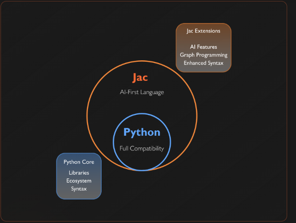
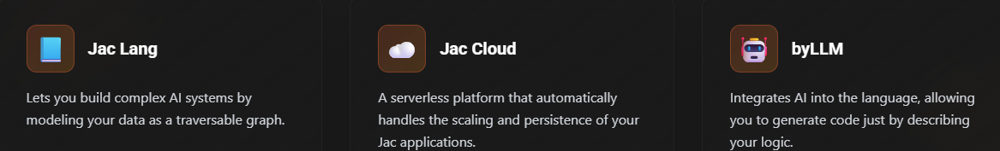

# Jac & Jaseci

The Jac programming language and Jaseci runtime stack builds on Python, introducing AI-first constructs, object-spatial programming, and scale-native constructs.

Everything Python: OOP+ with Native AI & Infinite Scale
Start with familiar Python syntax, then unlock AI capabilities, scale native programming and object spatial programming. Use Jac as a library in Python or write full Jac programs.

Jac introduces programming abstractions designed for AI, making it easy to integrate LLMs and multimodal models directly into your code with minimal effort.

#### Core components of the Jaseci ecosystem

